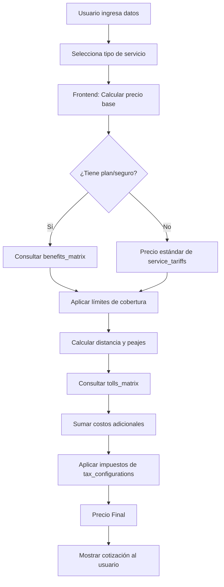

# 🚗 Universal Roadside Quoter

<div align="center">


**Un proyecto personal de código abierto para cotización de servicios de asistencia vial**

[Características](#-características-principales) •
[Stack](#-stack-tecnológico) •
[Arquitectura](#-arquitectura) •
[Seguridad](#-seguridad) •
[Instalación](#-instalación) •
[Base de Datos](#-modelo-de-datos)

</div>

---

## 📖 Sobre Este Proyecto

### 🎓 Propósito Educativo

Este es un **proyecto personal de código abierto** creado con fines de **aprendizaje y práctica**, poniendo en acción todo lo aprendido en los últimos años sobre:

- 📊 **Diseño y modelado de bases de datos NoSQL**
- 🎨 **Desarrollo web moderno con React y TypeScript**
- 🏛️ **Arquitectura de software (Clean Architecture / Hexagonal)**
- 🔐 **Implementación de sistemas de autenticación y autorización**
- ☁️ **Servicios en la nube (Firebase, BaaS)**

### 🎯 ¿Qué Es?

Un sistema de **cotización de servicios de asistencia vial** que permite:
- Calcular precios de servicios (grúas, auxilio mecánico, cambio de llantas, etc.)
- Gestionar múltiples planes y tarifas
- Considerar factores como distancia, peajes, horarios nocturnos y días festivos
- Generar cotizaciones profesionales en tiempo real

### 🔓 Código Abierto, Datos Seguros

> **🔒 Importante:** Todo el código es abierto y gratuito, pero **no contiene datos sensibles**.

**Toda la información confidencial vive únicamente en Firebase:**
- ✅ Precios y tarifas comerciales
- ✅ Configuración de impuestos
- ✅ Matrices de beneficios y peajes
- ✅ Lista de usuarios autorizados

**El código fuente no expone:**
- ❌ Credenciales de API (solo variables de entorno locales)
- ❌ Información de precios (todo en Firestore)
- ❌ Datos de clientes o usuarios
- ❌ Lógica de negocio propietaria (parametrizable desde la BD)

### 🌍 Adaptabilidad

Aunque fue desarrollado originalmente para servicios de asistencia vial en Costa Rica, **el sistema es completamente adaptable** a otras necesidades:

- 🚕 Servicios de taxi o transporte
- 🏠 Cotización de servicios a domicilio
- 📦 Calculadoras de envío y logística
- 🛠️ Cualquier negocio con tarifas basadas en distancia, tiempo o planes

La estructura modular permite modificar fácilmente los tipos de servicios, monedas, reglas de cálculo y más.

---

## ✨ Características Principales

### 🎛️ Para Usuarios

- **Autenticación Google** - Login rápido y seguro mediante SSO
- **Cotizador Inteligente** - Cálculo automático considerando múltiples variables
- **Planes Flexibles** - Soporte para membresías, seguros y servicios ad-hoc
- **Historial** - Consulta de cotizaciones anteriores
- **Interfaz Intuitiva** - Diseño moderno y responsivo

### ⚙️ Para Administradores

- **Gestión de Tarifas** - Actualización de precios en tiempo real
- **Control de Acceso** - Sistema de whitelist para usuarios autorizados
- **Configuración de Peajes** - Matriz de costos por rutas
- **Precios de Combustible** - Actualización periódica de tarifas de gasolina
- **Beneficios por Plan** - Definición de límites y coberturas

### 🏗️ Para Desarrolladores

- **Clean Architecture** - Código desacoplado y mantenible
- **TypeScript Estricto** - Type safety en toda la aplicación
- **Sin Backend Custom** - Firebase maneja toda la infraestructura
- **Plan Gratuito** - Opera completamente en el Spark Plan de Firebase
- **Documentado** - Código comentado y con ejemplos

---

## 🛠 Stack Tecnológico

### 🎨 Frontend

| Tecnología | Versión | Propósito |
|------------|---------|-----------|
| **React** | 18.x | Librería UI principal |
| **TypeScript** | 5.x | Type safety y mejor DX |
| **Vite** | 5.x | Build tool moderno y rápido |
| **Tailwind CSS** | 3.x | Utility-first styling |
| **Zustand** | 4.x | Estado global ligero |
| **React Router** | 6.x | Navegación SPA |

### 🔥 Backend & Infraestructura

| Tecnología | Plan | Propósito |
|------------|------|-----------|
| **Firebase Auth** | Spark (Free) | Autenticación con Google OAuth |
| **Firestore** | Spark (Free) | Base de datos NoSQL en tiempo real |
| **Firebase Hosting** | Spark (Free) | Despliegue de la aplicación |

### 📦 Librerías Auxiliares

```json
{
  "lucide-react": "Iconos SVG modernos",
  "framer-motion": "Animaciones fluidas",
  "clsx": "Gestión condicional de clases CSS",
  "date-fns": "Manipulación de fechas"
}
```

---

## 🏛️ Arquitectura

### 📐 Clean Architecture / Hexagonal

El proyecto sigue los principios de **separación de responsabilidades** y **desacoplamiento**:

```
src/
│
├── 📱 app/                  # Capa de Aplicación
│   ├── router/              # Configuración de rutas
│   ├── guards/              # Guardianes de autenticación
│   └── App.tsx              # Componente raíz
│
├── ⚙️ core/                 # Infraestructura
│   ├── config/              # Variables de entorno
│   ├── firebase/            # Cliente Firebase
│   └── storage/             # LocalStorage adapter
│
├── 🎯 modules/              # Dominio (Lógica de Negocio)
│   ├── auth/                # Módulo de Identidad
│   │   ├── services/        # AuthService
│   │   ├── store/           # Estado (Zustand)
│   │   └── components/      # UI de login
│   │
│   ├── calculator/          # Módulo CORE - Cotizador
│   │   ├── engine/          # Lógica pura (sin React)
│   │   ├── types/           # Interfaces TypeScript
│   │   └── components/      # Formularios de cotización
│   │
│   └── admin/               # Módulo de Configuración
│       ├── repositories/    # Acceso a Firestore
│       └── components/      # Paneles de administración
│
└── 🎨 shared/               # Capa de Presentación
    ├── ui/                  # Design System (Botones, Cards, etc.)
    ├── layouts/             # Layouts reutilizables
    └── hooks/               # React hooks compartidos
```

### 🧩 Principios de Diseño

| Principio | Implementación |
|-----------|----------------|
| **Separation of Concerns** | Lógica de negocio separada de la UI |
| **Dependency Inversion** | Módulos dependen de abstracciones |
| **Single Responsibility** | Cada módulo tiene una función clara |
| **Open/Closed** | Extensible sin modificar código existente |

---

## 🔐 Seguridad

### 🛡️ Estrategia de Defensa en Profundidad

El sistema implementa **múltiples capas de seguridad**:

#### 1️⃣ Autenticación (Firebase Auth)
```
Usuario → Google OAuth → Firebase Auth → Token JWT
```

#### 2️⃣ Autorización (Whitelist en Frontend)
```typescript
// Validación inmediata después del login
const checkWhitelist = async (email: string) => {
  const userDoc = await getDoc(doc(db, 'allowed_users', email));
  
  if (!userDoc.exists()) {
    await signOut(auth); // Logout forzado
    throw new Error('Usuario no autorizado');
  }
  
  return userDoc.data();
};
```

#### 3️⃣ Firestore Security Rules (Backend)
```javascript
rules_version = '2';
service cloud.firestore {
  match /databases/{database}/documents {
    
    // Regla global: Solo usuarios en whitelist
    match /{document=**} {
      allow read: if request.auth != null && 
        exists(/databases/$(database)/documents/allowed_users/$(request.auth.token.email));
    }
    
    // Whitelist es de solo lectura
    match /allowed_users/{email} {
      allow read: if request.auth.token.email == email;
      allow write: if false; // Solo admin desde consola
    }
    
    // Configuraciones: Solo lectura
    match /service_tariffs/{tariffId} {
      allow read: if request.auth != null;
      allow write: if false;
    }
    
    match /fuel_prices/{priceId} {
      allow read: if request.auth != null;
      allow write: if false;
    }
  }
}
```

### 🔒 ¿Por Qué Es Seguro?

✅ **Doble validación**: Frontend filtra UI, Firestore Rules bloquean acceso a datos  
✅ **Sin secretos en código**: Todo en variables de entorno  
✅ **Reglas declarativas**: No hay lógica de seguridad que hackear  
✅ **Token-based**: JWT válido requerido en cada petición  
✅ **Whitelist inmutable**: Solo modificable desde Firebase Console

> **⚠️ Incluso si alguien modifica el JavaScript localmente, las reglas de Firestore impedirán el acceso a los datos.**

---

## 💾 Modelo de Datos

### 📊 Colecciones en Firestore

El sistema utiliza **6 colecciones principales** optimizadas para lectura rápida:

```
universal-roadside-quoter (Database)
├── 👥 allowed_users
├── 💰 benefits_matrix
├── ⛽ fuel_prices
├── 🚗 service_tariffs
├── 📋 tax_configurations
└── 🛣️ tolls_matrix
```

---

### 1️⃣ `allowed_users` - Control de Acceso

**Propósito:** Whitelist de usuarios autorizados (SSO)

**Estructura de Documento:**

```json
// Document ID: kennywong080122@gmail.com
{
  "active": true,
  "name": "Kenny R. Ramos Wong",
  "role": "admin"
}
```

| Campo | Tipo | Descripción | Valores |
|-------|------|-------------|---------|
| `active` | boolean | Usuario habilitado | `true` / `false` |
| `name` | string | Nombre completo | "Kenny R. Ramos Wong" |
| `role` | string | Nivel de permisos | `"admin"` / `"quoter"` / `"viewer"` |

**Índices:** Document ID = email del usuario

---

### 2️⃣ `benefits_matrix` - Beneficios por Plan

**Propósito:** Define límites de cobertura para cada plan de membresía o seguro

**Estructura de Documento:**

```json
// Document ID: example_towing_base
{
  "benefit_type": "monetary_cap",
  "currency": "CRC",
  "limit_value": 100000,
  "partner_id": "example",
  "partner_name": "Example Partner",
  "plan_name": "Example Plan",
  "service_category": "towing"
}
```

| Campo | Tipo | Descripción | Ejemplo |
|-------|------|-------------|---------|
| `benefit_type` | string | Tipo de límite | `"monetary_cap"` / `"km_cap"` / `"unlimited"` |
| `currency` | string | Moneda del límite | `"CRC"` / `"USD"` |
| `limit_value` | number | Valor del tope | `100000` (₡100,000) |
| `partner_id` | string | ID del socio/aseguradora | `"example"` |
| `partner_name` | string | Nombre comercial | `"Example Partner"` |
| `plan_name` | string | Nombre del plan | `"Example Plan"` |
| `service_category` | string | Categoría de servicio | `"towing"` / `"heavy"` / `"light"` |

**Ejemplos de Documentos:**

```javascript
// Plan con límite monetario
{
  benefit_type: "monetary_cap",
  limit_value: 100000,  // ₡100,000 de cobertura
  currency: "CRC",
  service_category: "towing"
}

// Plan con límite de kilómetros
{
  benefit_type: "km_cap",
  limit_value: 50,  // 50 km máximo
  service_category: "towing"
}

// Plan ilimitado
{
  benefit_type: "unlimited",
  limit_value: null,
  service_category: "heavy"
}
```

---

### 3️⃣ `fuel_prices` - Precios de Combustible

**Propósito:** Almacena las tarifas actuales de combustible para cálculos de costo operativo

**Estructura de Documento:**

```json
// Document ID: CR_current_prices
{
  "currency": "CRC",
  "prices": {
    "diesel": 541,
    "regular": 609,
    "super": 636
  },
  "updated_at": "2026-02-15T14:00:00.000Z"
}
```

| Campo | Tipo | Descripción | Ejemplo |
|-------|------|-------------|---------|
| `currency` | string | Moneda de los precios | `"CRC"` |
| `prices.diesel` | number | Precio por litro diesel | `541` |
| `prices.regular` | number | Precio por litro regular | `609` |
| `prices.super` | number | Precio por litro súper | `636` |
| `updated_at` | timestamp | Última actualización | ISO 8601 string |

**Uso:**
- Se actualiza manualmente desde el panel de administración
- Costa Rica actualiza precios de combustible semanalmente
- Usado para calcular costos operativos de grúas

---

### 4️⃣ `service_tariffs` - Tarifas de Servicios

**Propósito:** Define precios base y estructura de cobro para cada tipo de servicio

**Estructura de Documento:**

```json
// Document ID: CR_heavy_towing
{
  "billing_rules": {
    "charge_ps": true,
    "charge_sd": true
  },
  "country_code": "CR",
  "currency": "CRC",
  "pricing_model": "tiered",
  "service_category": "heavy",
  "tiers": {
    "base": {
      "cost": 50000,
      "included_km": 10
    },
    "extra": {
      "cost_per_km": 5000
    }
  }
}
```

| Campo | Tipo | Descripción | Valores |
|-------|------|-------------|---------|
| `billing_rules.charge_ps` | boolean | Cobrar desde el punto de partida hasta el cliente | `true` / `false` |
| `billing_rules.charge_sd` | boolean | Cobrar solo lo recorrido con el cliente | `true` / `false` |
| `country_code` | string | País del servicio | `"CR"` / `"US"` |
| `currency` | string | Moneda de cobro | `"CRC"` / `"USD"` |
| `pricing_model` | string | Modelo de precio | `"tiered"` / `"flat"` / `"dynamic"` |
| `service_category` | string | Categoría del servicio | `"heavy"` / `"light"` / `"towing"` |
| `tiers.base.cost` | number | Precio base | `50000` |
| `tiers.base.included_km` | number | KM incluidos en precio base | `10` |
| `tiers.extra.cost_per_km` | number | Costo por KM adicional | `5000` |

**Tipos de Modelos de Precio:**

1. **Tiered (Por Escalas):**
```json
{
  "pricing_model": "tiered",
  "tiers": {
    "base": { "cost": 50000, "included_km": 10 },
    "extra": { "cost_per_km": 2000 }
  }
}
// Ejemplo: ₡50,000 por los primeros 10km, luego ₡2,000/km
```

2. **Flat (Tarifa Plana):**
```json
{
  "pricing_model": "flat",
  "base_cost": 25000
}
// Ejemplo: ₡25,000 sin importar distancia
```


---

### 5️⃣ `tax_configurations` - Configuración de Impuestos

**Propósito:** Define los impuestos aplicables a los servicios

**Estructura de Documento:**

```json
// Document ID: CR_default_tax
{
  "country_code": "CR",
  "rates": {
    "iva": 0.13,
    "service_charge": 0.10
  },
  "updated_at": "2026-01-01T00:00:00.000Z"
}
```

| Campo | Tipo | Descripción | Ejemplo |
|-------|------|-------------|---------|
| `country_code` | string | País de aplicación | `"CR"` |
| `rates.iva` | number | IVA (decimal) | `0.13` (13%) |
| `updated_at` | timestamp | Última actualización | ISO 8601 |

**Cálculo de Precio Final:**

```javascript
const basePrice = 50000;
const taxConfig = { iva: 0.13 };

const total = subtotal * (1 + taxConfig.iva);
// total = 56500
```

---

### 6️⃣ `tolls_matrix` - Matriz de Peajes

**Propósito:** Almacena costos de peajes por rutas

**Estructura de Documento:**

```json
// Document ID: alajuela_1
{
  "currency": "CRC",
  "name": "Alajuela",
  "prices": {
    "heavy": 1250,
    "light": 240,
    "microbus": 650,
    "tow": 475
  },
  "route": "Ruta 1"
}
```

| Campo | Tipo | Descripción | Ejemplo |
|-------|------|-------------|---------|
| `currency` | string | Moneda del peaje | `"CRC"` |
| `name` | string | Nombre del peaje | `"Alajuela"` / `"Atenas 27"` |
| `prices.heavy` | number | Tarifa vehículo pesado | `1250` |
| `prices.light` | number | Tarifa vehículo liviano | `240` |
| `prices.microbus` | number | Tarifa microbús | `650` |
| `prices.tow` | number | Tarifa grúa | `475` |
| `route` | string | Ruta o carretera | `"Ruta 1"` / `"Ruta 27"` |

**Rutas Comunes en Costa Rica:**

```javascript
// Peajes de la Ruta 1 (San José - Aeropuerto)
[
  { name: "Alajuela", route: "Ruta 1", prices: { tow: 475 } },
  { name: "Atenas 27", route: "Ruta 27", prices: { tow: 475 } }
]

// Peajes de la Ruta 27 (San José - Caldera)
[
  { name: "Ciudad Colón 27", route: "Ruta 27", prices: { tow: 475 } },
  { name: "Escazú 27", route: "Ruta 27", prices: { tow: 475 } },
  { name: "Pozón 27", route: "Ruta 27", prices: { tow: 475 } }
]
```

**Uso en Cotizaciones:**

```typescript
// Calcular costo total de peajes para una ruta
const calculateTollCost = (selectedTolls: string[], vehicleType: string) => {
  return selectedTolls.reduce((total, tollId) => {
    const toll = getTollById(tollId);
    return total + toll.prices[vehicleType];
  }, 0);
};

// Ejemplo: Ruta San José → Playa con 3 peajes
const tolls = ["ciudad_colon_27", "pozón_27", "pozón_rampa_27"];
const tollCost = calculateTollCost(tolls, "tow"); 
// tollCost = 1425 (₡475 × 3)
```

---

## 🔄 Flujo de Datos

### 📈 Ejemplo: Cotización de Servicio de Grúa



---

## 📦 Instalación

### ✅ Prerrequisitos

- Node.js >= 18.x
- npm >= 9.x
- Cuenta de Firebase (plan Spark - gratuito)
- Git

### 🚀 Pasos de Instalación

#### 1️⃣ Clonar el Repositorio

```bash
git clone https://github.com/tu-usuario/universal-roadside-quoter.git
cd universal-roadside-quoter
```

#### 2️⃣ Instalar Dependencias

```bash
npm install
```

#### 3️⃣ Configurar Firebase

1. Crea un proyecto en [Firebase Console](https://console.firebase.google.com)
2. Habilita **Authentication** → Proveedor: Google
3. Crea una base de datos **Firestore** en modo producción
4. Copia las credenciales de configuración

#### 4️⃣ Variables de Entorno

```bash
# Crear archivo de configuración
cp .env.example .env.local
```

```env
# .env.local
VITE_FIREBASE_API_KEY=tu_api_key_aqui
VITE_FIREBASE_AUTH_DOMAIN=tu_proyecto.firebaseapp.com
VITE_FIREBASE_PROJECT_ID=tu_proyecto_id
VITE_FIREBASE_STORAGE_BUCKET=tu_proyecto.appspot.com
VITE_FIREBASE_MESSAGING_SENDER_ID=123456789
VITE_FIREBASE_APP_ID=1:123456789:web:abcdef
```

#### 5️⃣ Configurar Firestore Rules

En Firebase Console → Firestore → Rules, pega:

```javascript
rules_version = '2';
service cloud.firestore {
  match /databases/{database}/documents {
    
    // Solo usuarios autenticados en whitelist
    match /{document=**} {
      allow read: if request.auth != null && 
        exists(/databases/$(database)/documents/allowed_users/$(request.auth.token.email));
    }
    
    // Whitelist de solo lectura
    match /allowed_users/{email} {
      allow read: if request.auth.token.email == email;
      allow write: if false;
    }
  }
}
```

#### 6️⃣ Inicializar Datos

**Opción A: Manualmente desde Firebase Console**

1. Ve a Firestore Database
2. Crea la colección `allowed_users`
3. Agrega un documento con tu email:
   ```json
   // Document ID: tu-email@gmail.com
   {
     "active": true,
     "name": "Tu Nombre",
     "role": "admin"
   }
   ```

4. Crea las colecciones necesarias (ver [Modelo de Datos](#-modelo-de-datos))

**Opción B: Script de inicialización (próximamente)**

```bash
npm run seed:firestore
```

#### 7️⃣ Ejecutar en Desarrollo

```bash
npm run dev
```

La aplicación estará disponible en `http://localhost:5173`

---

## 🚀 Despliegue

### Firebase Hosting (Recomendado)

```bash
# Instalar Firebase CLI
npm install -g firebase-tools

# Login
firebase login

# Inicializar proyecto
firebase init hosting

# Build
npm run build

# Deploy
firebase deploy --only hosting
```

### Otras Opciones

- **Vercel:** Compatible con builds de Vite
- **Netlify:** Requiere configuración de redirects para SPA
- **GitHub Pages:** Requiere ajustes en rutas base

---

## 🤝 Contribuciones

Este es un proyecto de aprendizaje personal, pero las contribuciones son bienvenidas:

1. Fork el proyecto
2. Crea una rama (`git checkout -b feature/nueva-funcionalidad`)
3. Commit tus cambios (`git commit -m 'Agrega nueva funcionalidad'`)
4. Push a la rama (`git push origin feature/nueva-funcionalidad`)
5. Abre un Pull Request

### 📝 Guías de Contribución

- Sigue los principios de Clean Architecture
- Agrega pruebas para nuevas funcionalidades
- Actualiza la documentación si es necesario
- Respeta el estilo de código (usar Prettier/ESLint)

---

## 📄 Licencia

Este proyecto está bajo la Licencia MIT. Ver archivo [LICENSE](LICENSE) para más detalles.

```
MIT License

Copyright (c) 2026 Kenny R. Ramos Wong

Permission is hereby granted, free of charge, to any person obtaining a copy
of this software and associated documentation files...
```

---

## 📞 Contacto

**Kenny R. Ramos Wong**
- Email: kennywong080122@gmail.com
- GitHub: [@tu-usuario](https://github.com/tu-usuario)
- LinkedIn: [Tu Perfil](https://linkedin.com/in/tu-perfil)

---

## 🙏 Agradecimientos

- **Firebase** por su increíble plan gratuito
- **React Team** por la mejor librería de UI
- **Tailwind CSS** por hacer el CSS divertido de nuevo
- **La comunidad open-source** por todo el conocimiento compartido

---

## 📚 Recursos Adicionales

### Documentación Oficial

- [React Docs](https://react.dev)
- [Firebase Docs](https://firebase.google.com/docs)
- [TypeScript Handbook](https://www.typescriptlang.org/docs/)
- [Tailwind CSS](https://tailwindcss.com/docs)

### Arquitectura

- [Clean Architecture - Robert C. Martin](https://blog.cleancoder.com/uncle-bob/2012/08/13/the-clean-architecture.html)
- [Hexagonal Architecture](https://alistair.cockburn.us/hexagonal-architecture/)

### Aprendizaje

- [Firebase Web Codelab](https://firebase.google.com/codelabs)
- [React + TypeScript Cheatsheet](https://react-typescript-cheatsheet.netlify.app/)

---

<div align="center">

**⭐ Si este proyecto te ayudó en tu aprendizaje, considera darle una estrella ⭐**

**Hecho con ❤️ por Kenny R. Ramos Wong**

</div>