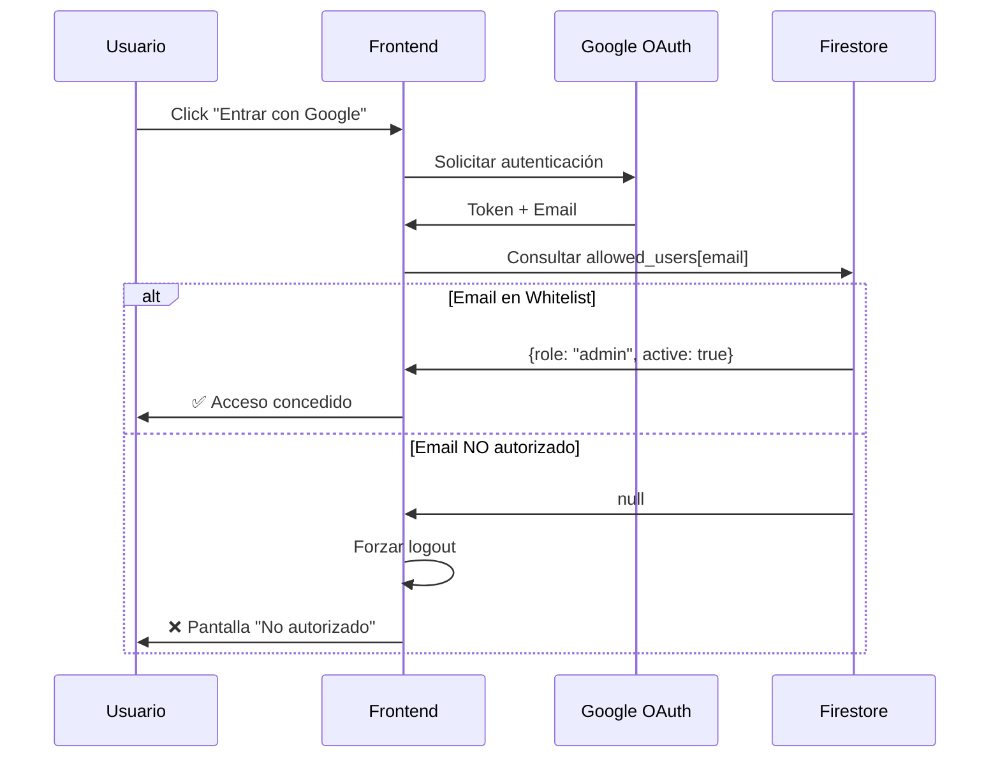

# 🗺️ Blueprint 360°: Universal Roadside Quoter

> **Filosofía:** Arquitectura Hexagonal en Frontend (Clean Architecture)  
> **Meta:** Sistema gratuito, seguro y desacoplado

---

## 📋 Tabla de Contenidos

- [Visión General](#-visión-general)
- [Stack Tecnológico](#-stack-tecnológico-y-dependencias)
- [Arquitectura](#-arquitectura-de-carpetas)
- [Seguridad](#-estrategia-de-seguridad)
- [Modelo de Datos](#-modelo-de-datos)
- [Primeros Pasos](#-primeros-pasos)

---

## 🎯 Visión General

Sistema de cotización de servicios de asistencia vial construido bajo los principios de **Clean Architecture** y **Arquitectura Hexagonal**. Diseñado para ser:

- 🆓 **Gratuito** - Aprovecha el plan Spark de Firebase
- 🔒 **Seguro** - SSO con Google + Sistema de Whitelist
- 🧩 **Desacoplado** - Lógica de negocio completamente separada de la UI
- ⚡ **Rápido** - Optimizado para lecturas y bajo costo operativo

---

## 🛠 Stack Tecnológico y Dependencias

### 🏛️ Núcleo y Lógica de Negocio
**Infrastructure & Domain Layer**

```bash
npm install firebase react-router-dom zustand
```

| Paquete | Propósito |
|---------|-----------|
| `firebase` | Backend as a Service (Auth + Firestore) |
| `react-router-dom` | Enrutamiento y navegación |
| `zustand` | Estado global ligero y reactivo |

### 🎨 UI y Experiencia de Usuario
**Presentation Layer**

```bash
npm install lucide-react framer-motion clsx tailwind-merge
```

| Paquete | Propósito |
|---------|-----------|
| `lucide-react` | Iconos modernos y consistentes |
| `framer-motion` | Animaciones fluidas |
| `clsx` + `tailwind-merge` | Gestión inteligente de clases CSS |

### ⚙️ Motor de Estilos
**Development Dependencies**

```bash
npm install -D tailwindcss postcss autoprefixer
```

---

## 🏗 Arquitectura de Carpetas

### 📐 Estructura Clean Architecture

```
src/
│
├── 📱 app/                          # CONFIGURACIÓN GLOBAL
│   ├── router/                      # → Definición de rutas (AppRouter)
│   ├── guards/                      # → Guardianes (RequireAuth, WhitelistCheck)
│   └── App.tsx                      # → Componente raíz limpio
│
├── ⚙️ core/                         # INFRAESTRUCTURA
│   ├── config/                      # → Variables de entorno (env.ts)
│   ├── firebase/                    # → Cliente Firebase inicializado
│   └── storage/                     # → Adaptador LocalStorage (cache)
│
├── 🎯 modules/                      # DOMINIO DEL NEGOCIO
│   │
│   ├── 🔐 auth/                     # MÓDULO: Identidad
│   │   ├── services/                # → AuthService (Login, Whitelist)
│   │   ├── store/                   # → AuthStore (Zustand: user, loading, error)
│   │   └── components/              # → LoginScreen, UnauthorizedView
│   │
│   ├── 💰 calculator/               # MÓDULO: Cotizador (CORE)
│   │   ├── engine/                  # → Lógica pura TypeScript
│   │   │                            #   (Algoritmos de precio sin React)
│   │   ├── types/                   # → Interfaces (Quote, Vehicle, ServiceType)
│   │   └── components/              # → Formularios y visualización
│   │
│   └── 👤 admin/                    # MÓDULO: Configuración
│       ├── repositories/            # → ConfigRepository (Firestore)
│       └── components/              # → UI para editar precios
│
├── 🎨 shared/                       # CAPA DE PRESENTACIÓN
│   ├── ui/                          # → Componentes tontos (Button, Card, Input)
│   ├── layouts/                     # → DashboardLayout, AuthLayout
│   └── hooks/                       # → Hooks genéricos (useTheme, useMobile)
│
└── main.tsx                         # 🚀 Punto de entrada
```

### 🧩 Separación de Responsabilidades

| Capa | Responsabilidad | Ejemplo |
|------|----------------|---------|
| **app/** | Enrutamiento y configuración global | Guard de autenticación |
| **core/** | Infraestructura técnica | Cliente de Firebase |
| **modules/** | Lógica de negocio pura | Motor de cálculo de precios |
| **shared/** | Componentes reutilizables | Sistema de diseño (UI Kit) |

---

## 🔐 Estrategia de Seguridad

### 🎫 Sistema SSO + Whitelist

#### 🔄 Flujo de Autenticación



#### 🛡️ Capas de Protección

##### 1️⃣ **Gatekeeper (Frontend)**

```typescript
// Validación en el cliente
const checkWhitelist = async (email: string) => {
  const userDoc = await getDoc(doc(db, 'allowed_users', email));
  
  if (!userDoc.exists()) {
    await signOut(auth);
    throw new Error('Usuario no autorizado');
  }
  
  return userDoc.data();
};
```

##### 2️⃣ **Doble Candado (Firestore Rules)**

```javascript
// Reglas de seguridad en Firestore
rules_version = '2';
service cloud.firestore {
  match /databases/{database}/documents {
    
    // Solo usuarios en la whitelist pueden leer datos
    match /{document=**} {
      allow read: if request.auth != null && 
                     exists(/databases/$(database)/documents/allowed_users/$(request.auth.token.email));
    }
    
    // La whitelist es de solo lectura
    match /allowed_users/{email} {
      allow read: if request.auth.token.email == email;
      allow write: if false; // Solo admin desde consola
    }
  }
}
```

> ⚠️ **Importante:** Incluso si alguien modifica el código JavaScript localmente, las reglas de Firestore impedirán el acceso a los datos.

---

## 💾 Modelo de Datos

### 📊 Diseño NoSQL Optimizado

> **Principio:** Estructura optimizada para lecturas rápidas y bajo costo operativo

#### 🗂️ Colección: `allowed_users`

**Propósito:** Control de acceso (Whitelist)

```json
// Document ID: juan@empresa.com
{
  "role": "admin",        // "admin" | "quoter"
  "name": "Juan Pérez",
  "active": true,
  "createdAt": "2024-01-15T10:30:00Z"
}
```

| Campo | Tipo | Descripción |
|-------|------|-------------|
| `role` | string | Nivel de permisos del usuario |
| `name` | string | Nombre completo para UI |
| `active` | boolean | Flag para desactivar sin eliminar |

---

#### ⚙️ Colección: `pricing_config`

**Propósito:** Configuración del negocio (Singleton)

```json
// Document ID: current_rates
{
  "base_fee": 50.00,
  "km_price": 1.50,
  "night_multiplier": 1.2,
  "holiday_multiplier": 1.5,
  "lastUpdated": "2024-02-14T08:00:00Z"
}
```

| Campo | Tipo | Descripción |
|-------|------|-------------|
| `base_fee` | number | Tarifa base del servicio |
| `km_price` | number | Precio por kilómetro |
| `night_multiplier` | number | Factor nocturno (8pm-6am) |
| `holiday_multiplier` | number | Factor días festivos |

> 💡 **Optimización:** Este documento se descarga al inicio y se mantiene en caché local para evitar lecturas repetidas.

---

#### 📝 Colección: `quotes`

**Propósito:** Historial de cotizaciones

```json
// Document ID: auto-generated
{
  "userId": "juan@empresa.com",
  "createdAt": "2024-02-14T14:25:00Z",
  "client": {
    "name": "María González",
    "phone": "+506-8888-8888"
  },
  "service": {
    "type": "tow",              // "tow" | "jump_start" | "tire_change"
    "distance_km": 25.5,
    "is_night": false,
    "is_holiday": false
  },
  "pricing": {
    "base": 50.00,
    "distance": 38.25,
    "multipliers": 0,
    "total": 88.25
  },
  "vehicle": {
    "make": "Toyota",
    "model": "Corolla",
    "year": 2020,
    "plate": "ABC-123"
  }
}
```

---

## 🚀 Primeros Pasos

### 📦 Instalación

```bash
# 1. Clonar el repositorio
git clone <repository-url>
cd roadside-quoter

# 2. Instalar dependencias
npm install

# 3. Configurar variables de entorno
cp .env.example .env.local
# Editar .env.local con tus credenciales de Firebase
```

### ⚙️ Configuración de Firebase

1. Crear proyecto en [Firebase Console](https://console.firebase.google.com)
2. Habilitar **Authentication** → Google Sign-In
3. Habilitar **Firestore Database**
4. Copiar configuración al archivo `.env.local`:

```env
VITE_FIREBASE_API_KEY=tu_api_key
VITE_FIREBASE_AUTH_DOMAIN=tu_auth_domain
VITE_FIREBASE_PROJECT_ID=tu_project_id
VITE_FIREBASE_STORAGE_BUCKET=tu_storage_bucket
VITE_FIREBASE_MESSAGING_SENDER_ID=tu_sender_id
VITE_FIREBASE_APP_ID=tu_app_id
```

### 🔥 Configuración Inicial de Firestore

```bash
# Ejecutar script de inicialización
npm run seed:firestore
```

Este script creará:
- ✅ Documento inicial en `pricing_config`
- ✅ Usuario admin en `allowed_users` (usando tu email)

### 🎯 Desarrollo

```bash
# Iniciar servidor de desarrollo
npm run dev

# Compilar para producción
npm run build

# Preview de producción
npm run preview
```

---

## 📚 Recursos Adicionales

- [Documentación de Firebase](https://firebase.google.com/docs)
- [Clean Architecture en React](https://blog.cleancoder.com/uncle-bob/2012/08/13/the-clean-architecture.html)
- [Zustand State Management](https://docs.pmnd.rs/zustand)

---

## 📄 Licencia

Este proyecto está bajo la licencia MIT. Ver archivo `LICENSE` para más detalles.

---

<div align="center">

**Hecho con ❤️ usando Clean Architecture**

⭐ Si este proyecto te fue útil, considera darle una estrella

</div>